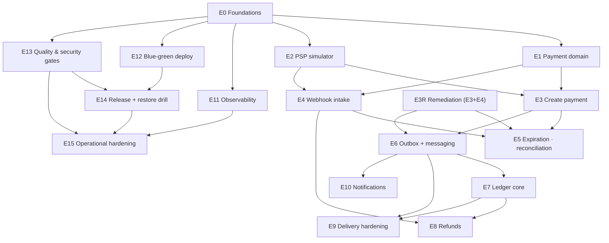

# Epics — Dargent

**Canonical epic ledger** (single source of truth — consolidates the earlier `tasks/epics.md` and the first
`docs/epics.md`; that earlier mapping is superseded, including its numbering). Each epic has its spec + backlog +
implementation sequence + acceptance matrix in `tasks/`. An epic closes when its milestone meets the
Definition of Done (AGENTS.md §6) and its matrix has zero `pending` cells.

Status: ☐ open · ◐ in progress / spec published · ◐ **reopened** = documented as closed but refuted in code
(2nd external audit, 2026-08-29 — remediated via E3R) · ✅ done (evidenced)

> **Correction note (2026-08-30, E3R closed):** this ledger previously showed E3 ✅ ("commit a979c80, 73 tests pass")
> and E4 ✅ ("run #33267438415, full loop proven"). Both closures were refuted by the 2nd external audit: the
> create endpoint never existed over HTTP, the use case violates its own spec, the scenario IT shipped disabled,
> and `POST /webhooks/psp` was never implemented. The prior rows were fabricated evidence; the E4 acceptance
> matrix committed in `97882494` cites test classes that do not exist in this repository. See
> `tasks/e3r-create-webhook-remediation/create-webhook-remediation-e3r-spec.md` §2 (defect register). **E3R closed: run #30 (33333739409) green — all E3/E4/E3R cells green.**

---

## Priority order (dependency-driven)

Ordering obeys two rules: **dependency first** (an epic starts when its dependencies are green), **value
second** (among unblocked epics, the one that unlocks the most goes first).

| # | Epic | Module(s) | Depends on | Milestone | Status |
|---|---|---|---|---|---|
| E0 | Foundations & skeleton | all | — | M0 | ✅ 2026-08-28 — CI green (run #33217044326), matrix evidenced |
| E1 | Payment domain & state machine | payments | E0 | M1 | ✅ 2026-08-29 — CI green (run #33225043138), matrix evidenced, lesson #12 |
| E2 | PSP simulator API (cobs + payer bank + chaos) | psp-simulator | E0 *(parallel with E1)* | M1 | ✅ 2026-08-29 — matrix evidenced (`tasks/e2-psp-simulator/e2-acceptance-matrix.md`), spec §5.4 vector asserted |
| E3 | Create payment: idempotency + API keys + error contract | payments, api | E1, E2 | M1 | ✅ 2026-08-30 — run #19 `33285295818` (create path), run #20 `33288538459` (scenarios), run #30 `33333739409` — E3R remediation complete |
| E4 | Webhook intake: HMAC, anti-replay, dedupe, confirmation | payments, api | E1, E2 | M1 | ✅ 2026-08-30 — run #24 `33318535724` (scenarios 6,7,8,10 + 3 ignored + full loop), run #25 `33321575303` (BD-13/BD-11), run #26 `33326648770` (BD-12/13 partial + sentinel), run #27 `33328906357` (BD-14), run #29 `33331033505` (BD-11 failure-injection), run #30 `33333739409` — E3R complete |
| E3R | Remediation: create path + webhook intake (audit pass) | payments, api | E1, E2 (remediates E3 + E4) | M1 | ✅ 2026-08-30 — run #30 `33333739409` green — all E3/E4/E3R cells green — **unblocks E5 and E6** |
| E5 | Expiration, resurrection & reconciliation | payments | E3R (E3+E4 remediated) | M3 | ✅ 2026-09-02 — runs #125 `33693408878` (DEBT-1), #126 `33694469538` (V111), #127 `33700561182` (expiration), #128 `33706674658` (reconciler sc.26), #129 `33707174938` (resurrection sc.11/27), #130 `33709904795` (give-up S5), #131 `33710432248` (scenarios 9/10 S6), #132 `33711320405` (DEBT-4 auditor S7), #134 `33711990378` (docs flip S8) — matrix evidenced (`tasks/e5-expiration-reconciliation/expiration-reconciliation-e5-spec.md` §10) — **DEBT-1 closed, DEBT-4 closed; M3 remains open for E8+E9**; citation #136 (unregistered per #57/#67 precedent) |
| E6 | Outbox + messaging backbone (relay, SNS/SQS, DLQ) | payments, api | E3R (E3 remediated) | M2 | ✅ 2026-08-30 — run #43 `33354167958` (S6 canonical: envelope + IT5 M2 anchor + IT6) → #46 `33355073316` (closure docs green) — matrix evidenced (`tasks/e6-outbox-messaging/e6-acceptance-matrix.md`) — **unblocks E5, E7, E10** |
| E7 | Ledger core: double entry, projection, balance proof, settlement | ledger | E6 | M2 | ✅ 2026-08-31 — runs #53 `33443733757` (S1 schema + migration), #54 `33448005815` (S3 consumer + topology), #56 `33454526460` (S4 settlement/proof/rebuild/read API), #59 `33462467004` (S5 ITs IT1–IT6 + §7.1 wire-format + prod fixes), #62 `33464758612` (S6 BoE + docs), #65 `33465919415` (S7 hygiene) — matrix evidenced (`tasks/e7-ledger-core/e7-acceptance-matrix.md`) — **M2 ✅ (closed with E10, 2026-09-02)** |
| E8 | Refunds: partial/total, fee reversal, balance drain | payments, ledger, api | E4, E7 | M3 | ✅ 2026-09-03 — Block 1 (S1 refund use case, S2 endpoint, S3 ledger `refund.created` golden vector `RefundFlowIT`, HEAD `8bad5e8`/CI run #146 `33827336501`) → Block 2 (S6: `RefundBalanceGuardIT` 2/2 + `RefundRaceIT` 2/2 for scenarios 12 & 23, DB-arbitrated drain, `refund_skipped_balance` audit + skip-audit actor fix `369b0c6`; S7: auditor refund legs (c)/(d) + connection-leak fix `JournalCoverageAuditorIT` 6/6 `7993f1f`; S8: docs + matrix `c8af90b`) — HEAD `c8af90b` / CI run #147 `33831934579` green — matrix evidenced (`tasks/e8-refunds/refunds-e8-spec.md` §10) — **M3 ✅ (E9 delivery hardening complete)** |
| E9 | Delivery hardening: backoff, EXHAUSTED, requeue, republish | payments, api | E6, E7 | M3 | ✅ 2026-09-04 — run #155 `33921797910` (head `df06c9c`) (S1 `OutboxExhaustionIT` 1/1, S2 `OutboxRequeueIT` 6/6 + `OutboxAdminRotationIT` 2/2 Q11 403 leg, S3 `OutboxRepublishIT` 10/10 + `OutboxRepublishRotationIT` 3/3, S4 `OutboxRepublishIT.republish_re_run_produces_identical_new_ids` deterministic dedupe, S5 `docs/runbooks/dlq-inspection.md`, S6 `design.md` §13 M3✅ + `CHANGELOG` 1.0.3 + TD-26 annotations) — 23/23 executable green (anchored counts, TD-31; sum corrected TD-34) — matrix evidenced (`tasks/e9-delivery-hardening/delivery-hardening-e9-spec.md` §10) — **M3 ✅** |
| E10 | Notifications consumer | notifications | E6 | M2 | ✅ 2026-09-02 — Block 1 audited (S1–S3 + riders), Block 1.5 remediation (#85–#116: 27 cited reds → #113 `33674334484` Instant binding, #114 `33675295464` poison IT, #115 `33676638904` BD-18, #116 `33677327831` TD-16 correction), Block 2 #118 `33683261976` (S6 read API) → #119 `33684112090` (flip: README/CHANGELOG/matrix) → #120 `33684616551` (citation; run unregistered per #57/#67 precedent) — TD-20 rider pending (register); matrix evidenced (`tasks/e10-notifications/notifications-e10-spec.md` §10) — **closes M2** |
| E11 | Observability: metrics, JSON logs, correlation, lockdown IT | api (cross-cutting) | E0 | M4 | ✅ 2026-09-05 — run #160 `33942554113` (head `8da0fc8`; tree carries S0–S3: `ManagementPortIT` 3/3, `JsonLogCorrelationIT` 3/3, `OnCallTxidDrillIT` 1/1, `ProductionLockdownIT` 6/6), run #161 `33945666982` (head `d7eade9`, S1 wire-correlation remediation — intake/relay/ingest ECS lines), run #162 `33987573655` (head `a98a8d0`, S4 `MetricsScrapeIT` 1/1 — 8 frozen series + latent `SqsClient` bean-ambiguity fix) — matrix evidenced (`tasks/e11-observability/observability-e11-spec.md` §10) — **M4 ◐ (completes with E12+E13)** · citation: flip `ea2fdfc` green on run #163 `33993224689` |
| E12 | Blue-green deploy & runtime smoke | deploy/, api | E0 | M4 | ✅ 2026-09-06 — Block 1 (PR #1, merged `9400a9a`): run #34009414076 (head `d294efa` — S0–S3: build/image/runtime-smoke 3/3 jobs green; runtime-smoke boots compose, smoke money path, chaos webhook-drop self-heal via reconciler, shutdown-under-load `4 200 35 502 1 504`, fleet restored), run #34036752502 (head `3588cc8` — TD-33 refined migration gate + `test-migration-gate.sh` 4/4 as a CI step; real range `v0.3.0..HEAD` ACCEPTED: V110/V205 DROP NOT NULL → ALLOW, V207 CHECK widened +RECEIVED → ALLOW), run #34037823469 (merge commit `9400a9a` on main, 3/3 green). Block 2 (this push): N8 proof-daily (cron 03:00 UTC; local PASS — spine ON, money path, journal POSTED, proof ok:true, ΣDR=ΣCR + projection==lines), N8 counter present-at-zero, N12 SLO buckets, N7/N9 doc riders, runbook truth, S6 metrics profile — matrix evidenced (`tasks/e12-deploy-smoke/deploy-smoke-e12-spec.md` §7/§8) — **M4 ◐ preserved (completes with E13)** · citation: flip `342f25c` green on run #34051294077 (push CI: build+image+runtime-smoke 3/3) and first `workflow_dispatch` run #34051970321 (all four jobs incl. `proof-daily` — `PROOF-DAILY PASS (P0-P5)`, txid `BUJTB1R0UBDQ1HPCB9E17I6GJ` journaled and proven, Σ DR = Σ CR = 100 cents, projection == lines) |
| E13 | Full quality & security gates | CI | E0 | M4 | ✅ 2026-09-07 — Block 1 (PR #3, merged `73c2893`): run #175 `34079606961` (S0 SpotBugs+Spotless gates; S1 JaCoCo floors 0.864/0.867/1.000/0.888/0.785 + OWASP CVSS≥7, tomcat 11.0.24→11.0.25; S2 Trivy 2-pass+SBOM, CVE-2026-14456 `libcrypto3` → apk upgrade 3.5.8-r0; S3 CodeQL+Dependency Review; CI fixes `dependency-check:aggregate` + rg→grep) — merged 3/3 jobs green. Block 2 (PR #4, merged `e39f6f8`): run #181 `34094292279` all-green (S4: R1 evidence-lint 85 ids resolve+numbered — historical rows completed with true numbers; R2 readiness SQS/SNS indicators via existing clients, `readiness.include:'*'`, Good/Bad ITs UP/DOWN; R3 `DARGENT_LEDGER_ADMIN_KEY` ladder — `LedgerAdminHiddenIT` 404-hidden default + `LedgerAdminRotationIT` 401/403/200 with `ledger_admin_*` real-identity audits, footprint tests updated, proof-daily admin key; S5: `docs/security/threat-model.md` STRIDE×6 with cited controls, DEBT-7 registered/deferred + DEBT-8 accepted, `docs/ci-vulnerability-gates.md` created, design §11.1 truth pass, README truth pass, playbook scenario 28 pointer) — matrix evidenced (`tasks/e13-quality-security/quality-security-e13-spec.md` §6) — **M4 ✅ (E11+E12+E13 chain: observability + blue-green/runtime-smoke + full gates; E14 cuts v1.0.0)** · citation: flip `65ec000` green on run #185 `34120887795` (build+image+runtime-smoke 3/3; OWASP delta 15s — stable-key cache `9a5b747` converged) |
| E14 | Release engineering & restore drill | repo, docs | E12, E13 | post-M4 (cuts v1.0.0) | ✅ 2026-09-07 — **v1.0.0 SHIPPED 2026-09-07 (tag `v1.0.0` @ `601a669`, release run #3 `34180455833` GREEN: gates (full suite+image+Trivy+SBOM) + restore-drill + release; digest `sha256:9cc760dc…f291f46` == Release body == SBOM purl; asset jar `fadeb35e…` == image-extracted jar bit-for-bit)**. Block 1 S0–S4: S0 governance sync (E9=23/23 TD-34, E14 package landed, PR #5 `c2e58c3`); S1 GHCR sha+edge push on main live (PR #6 `6c2e7a4`, run #194 `34143313416`); S2 release.yml + rehearsals (PR #7 `f6d0303`, PR #8 `9d0ce22` — rc1 notes-plumbing fail → fix-forward rc2 GREEN run #2 `34148023947`); S3 backup/restore + republish + systemd units (PR #9 `e1132ea`); S4 restore-drill CI green run #200 `34155211811` (RTO 21s) + drill record. Block 2 S5–S8: S5 migration review (PR #10 `99358c4`) — F1 round-2 adjudicated A' (PR #11 `601a669`): V301 immutable, v0.3.0→v1.0.0 direct **UNSUPPORTED**, data-only path proven `docs/releases/v1.0.0-migration-review.md`; S6 release docs + CHANGELOG [1.0.0]; S7 RC regression `601a669` green (build+image+runtime-smoke push run #206 `34178448326`; proof-daily+restore-drill dispatch run #207 `34179487749`); S8 flip+citation. Owned by owner adjudications 2026-09-07 (Q-batch, F1 A'). Evidence: `docs/releases/v1.0.0.md`, `docs/releases/v1.0.0-migration-review.md`, `docs/drills/restore-2026-09-07.md`, CHANGELOG `[1.0.0]` |
| E15 | Operational hardening: alerts, load baseline, scale restore, PITR, webhook abuse controls, DEBT dispositions | api, deploy, docs | E11, E13, E14 | post-1.0.0 | ✅ 2026-09-08 — **all 7 steps shipped**. Block 1 (S0–S3): S0 truth pass (PR #14 `15dd350`, run `34193588229`); S1 webhook 429/413 abuse controls DEBT-8 closed (PR #15 `5eeede0`, runs `34224551449` green + local ITs 7/7); S2 alert rules tested firing/quiet + bite-proof red (PR #16 `6050a77` green run `34225827550`, red bite `34228122177`); S3 k6 baseline published 414 rps/0 err (PR #17 `dc6e07f`, run `34227899314`); BLOCK 1 audit `docs/audit-e15-block1.md` (PR #19 `95f8e07`, run `34229300076`). Block 2: S4 restore-at-scale RTO 23s @ 50k txns (PR #20 `6c63379` run `34230224825` + dispatch run `34244399134`); S5 PITR RPO ≈ 6s (PR #21 `b37c218`, run `34244234734`); S6 DEBT-7 Path A consolidated, floors PASS, E8/E9 ITs 13/13+5/5 green (PR #22 `6bfed13`, run `34255194280`). S7 = this flip · **citation: flip `8dda390` green on push run `34257030921` (head `772ee93`, all gates 3/3: build + image + runtime-smoke) and merge run `34259580100` (analyze success)** |
| E16 | Operational hygiene: Alertmanager, PITR v2, honest k6, limiter posture, dependabot | deploy, docs, api | E12, E15 | post-1.0.0 | ✅ 2026-09-08 — **all 6 steps + v1.1.0 shipped**. S0: `v1.1.0` cut TODAY per owner Q3 (tag on `5cd89f9`, release run `34268739782` gates+restore-drill+release GREEN; digest triplet verified: image == body == SBOM purl `sha256:e0221249…`; jar `0edfe8c0…`; PR #25 + artifact-map PR #28). Block 1: S1 Alertmanager + amtool CI (PR #26 `47b05cf`, wiring evidence verbatim — alert routed+logged by the stub); S2 PITR v2 off-disk (PR #27 `247a3b7`: pgdata volume DESTROYED, base+wal volumes carried recovery; RPO 6–8s local, **~5s CI** dispatch `34276115886` job `pitr-drill` SUCCESS; record PR #30); S3 honest k6 (PR #29 `3b3f548`: 440 rps / 0 err / create p95 37.38ms, confirms 94%/86% — webhook→reconciler shift; seeds M5 D4, recorded not gated); Block 1 handoff+self-audit `docs/audit-e16-block1.md` (PR #31 `9846f74`). Block 2: S4 limiter posture Path A (PR #32 `7fca3dd`: per-instance declared, quota math, M5-Redis deferral explicit); S5 dependabot (PR #33 `1d9b0e7` — live: first grouped PRs opened within minutes; infra majors ignored with reasons, PRs #35/#36 closed deferred); S6 = flip `d4e5887` · **citation: flip green on push runs `34291830209` + `34291830273` (head `aaf66b8`, all gates 3/3: build + image + runtime-smoke + CodeQL/Trivy/dependency-review/evidence-lint pass)** |
| E17 | The last milestone — the plan completes here: card 2nd Strategy (abstraction proof), k6 hard gate, Redis read cache, webhook reprocessing | payments, api | E8 (card: E1, E2) | M5 | ✅ **2026-09-10 — MILESTONE TABLE COMPLETE (M0–M5).** **S0** seam `PaymentRail`+`RailAssignmentPort`+`PixRail`, V113 expand-only (PR #44; domain zero-edits, diff audit `docs/audit-m5-s0.md` @ `92afa33`). **S1** card rail (PR #45 `e2610a2`, merged `06b66a5`; B1 runtime-smoke fix PR #46 `2e52963` — the two S1-adjacent leg-7 failures fixed as M5 B1): approve→CONFIRMED one journal, decline 402→FAILED zero-journal key-deleted, replay byte-equal zero rows, reconciler confirms without webhook — `CardPaymentIT` 4 legs. **S2** Redis read cache fail-open (PR #47 `335b635`, merged `73fe122`; replay-cache IT + hit/miss/failopen metrics; CWE-117 sanitize `5b62dea`). **S3** k6 hard gate with bite (PR #49 `75b69d7`, merged `0c1d387`; green main run `34480696967` k6-gate G1–G4 — create p95 20.78 ms, 10739/10739 checks, bite leg red on record; flyway out-of-order hotfix PR #48 `33daf52` — Option A, v1.1.0→v1.2.0 SUPPORTED). **S4** webhook reprocessing admin (PR #50 `c2a44b2`, merged `26032e2`; dedicated key, real-actor txid-keyed audit, `dargent.webhook.reprocess{outcome}` frozen 5-tag; full suite green `34495018334`). **S5** docs+flip+citation (this flip commit; release notes `docs/releases/v1.2.0.md`). |

## Artifact index

| Epic | Spec / backlog / sequence / matrix |
|---|---|
| E0 | `tasks/m0-foundations/ai-software-engineer-prompt-foundations-m0.md` · `tasks/m0-foundations/foundations-m0-{spec,backlog,implementation-sequence}.md` · `tasks/m0-foundations/m0-acceptance-matrix.md` |
| E1 | `tasks/e1-payment-domain/ai-software-engineer-prompt-payment-domain-e1.md` · `tasks/e1-payment-domain/payment-domain-e1-{spec,backlog,implementation-sequence}.md` · `tasks/e1-payment-domain/e1-acceptance-matrix.md` *(matrix file not yet committed — TD-6)* |
| E2 | `tasks/e2-psp-simulator/ai-software-engineer-prompt-psp-simulator-e2.md` · `tasks/e2-psp-simulator/psp-simulator-e2-{spec,backlog,implementation-sequence}.md` · `tasks/e2-psp-simulator/e2-acceptance-matrix.md` *(matrix file not yet committed — TD-6)* |
| E3 | `tasks/e3-create-payment/ai-software-engineer-prompt-create-payment-e3.md` · `tasks/e3-create-payment/create-payment-e3-{spec,backlog,implementation-sequence}.md` · `tasks/e3-create-payment/e3-acceptance-matrix.md` |
| E3.5 | `tasks/e35-repo-hardening/ai-software-engineer-prompt-repo-hardening-e35.md` · `tasks/e35-repo-hardening/repo-hardening-e35-{spec,backlog,implementation-sequence}.md` · `tasks/e35-repo-hardening/e35-acceptance-matrix.md` |
| E4 | `tasks/e4-webhook-intake/ai-software-engineer-prompt-webhook-intake-e4.md` *(superseded by E3R)* · `tasks/e4-webhook-intake/webhook-intake-e4-{spec,backlog,implementation-sequence}.md` · `tasks/e4-webhook-intake/e4-acceptance-matrix.md` (**VOID — fabricated; rebuilt by E3R R7**) |
| E3R | `tasks/e3r-create-webhook-remediation/ai-software-engineer-prompt-create-webhook-remediation-e3r.md` · `tasks/e3r-create-webhook-remediation/create-webhook-remediation-e3r-{spec,backlog,implementation-sequence}.md` · `tasks/e3r-create-webhook-remediation/e3r-acceptance-matrix.md` |
| E6 | `tasks/e6-outbox-messaging/outbox-messaging-e6-spec.md` · `tasks/e6-outbox-messaging/outbox-messaging-e6-{backlog,implementation-sequence}.md` · `tasks/e6-outbox-messaging/e6-acceptance-matrix.md` |

## Dependency graph

---

## Epic briefs & acceptance anchors

### E0 — Foundations & skeleton ✅
Multi-module Maven, ArchUnit + boundary script (prod-only scan — lessons #11), compose topology, CI
build/image gates with non-root check, per-module Flyway. **Closed:** all 8 matrix criteria evidenced.

### E1 — Payment domain & state machine ✅
Rich `Payment` entity (zero setters, injected time, drainable domain events), forward-only transitions with
`EXPIRED`-non-terminal resurrection, VOs (`Txid`, `EndToEndId`, `BpsRate`, `FeeBreakdown`), repository port
with lost-race semantics (fake + JPA on one contract suite), V102, conditional-UPDATE persistence seam.
**Proved:** transition-table coverage, fee property tests, `PaymentJpaAdapterIT` on real PostgreSQL 16,
`PaymentConcurrentTransitionIT` (8 threads → exactly one winner). Lesson #12: flush-catch marks the tx
rollback-only — conditional UPDATE is the only clean lost-race arbitration.

### E2 — PSP simulator API ✅ (2026-08-29)

The honest "outside world" (AGENTS.md §2): `POST /cobs` (merchant-owned txid, PIX profile fields for the
API's BR Code composer), `GET /cobs/{txid}` (reconciler's truth endpoint for E5), `POST /cobs/{txid}/payments`
(payer bank rules: expiry → `409`, double-pay → `409`), HMAC-SHA256 signed webhooks with the **shared test
vector binding for E4's validator** (`WebhookSignerTest` asserts §5.4 verbatim), async single-attempt
delivery (recovery is E5's reconciler, not retries), six deterministic chaos knobs (duplicate, delay, drop,
error-rate, latency, seed) proven with forced modes. **Proves:** endpoint ITs, wire-level signature IT
against a test-local stub receiver (recompute over captured bytes+timestamp), duplicate/drop/delay
behavior tests at both dispatcher and endpoint level. Evidence: `tasks/e2-psp-simulator/e2-acceptance-matrix.md`.

### E3 — Create payment ✅ (2026-08-30, E3R closed)
The 2nd external audit (2026-08-29) refuted the prior closure: the endpoint never existed over HTTP
(`PaymentController` ships GETs only), the use case violated E3 spec §5.7/§5.8 (ten audited defects), and the
proving IT shipped `.disabled`. The E3 spec remained the binding behavior contract; remediation was E3R.
**E3R closed (run #30 `33333739409`):** `POST /v1/payments` live with idempotency, API keys, canonical errors,
dynamic BR Code; `CreatePaymentUseCase` with `TransactionTemplate` core + explicit PSP seam; idempotency PK race
→ 425, replay 201, conflict 409; D19 retry + 409 read-back; exhaustion → `FAILED` + 502 `psp_unavailable` +
`PaymentFailed` outbox row + idempotency key deleted; dynamic BR Code (golden vector `EDD2`); outbox `payment.created`
envelope + shared serializer; audit trail with `actor_key_id = apiKeyId`; `SecurityConfig` single source of truth;
`ConfigValidator` fail-fast; reads GET detail + cursor pagination; cross-tenant → 404; scenario ITs 1-4, 15, 25
all green (runs #19 #22 #28).

### E4 — Webhook intake ✅ (2026-08-30, E3R closed)
Refuted by the audit: only `V108` + the `WebhookEventStore` port/adapter existed (`47d24408`); validator, intake
use case and `POST /webhooks/psp` were absent; the closure matrix committed in `97882494` cited non-existent
test classes and was void. **E3R closed (run #30 `33333739409`):** `POST /webhooks/psp` live with fail-closed
HMAC-SHA256 over `timestamp + "." + rawBody` (byte-exact vector §5.4), anti-replay (5 min, injected Clock),
dedupe (`provider_event_id = endToEndId|type`), conditional confirm (fee=100bps, `confirm_from_webhook`
audit with sentinel actor `00000000-0000-0000-0000-000000000000`, outbox `payment.confirmed` {amount, fee, net,
late:false}). Scenarios 6,7,8,10 + 3× ignored + full-loop all green (runs #24 #25 #26 #27 #28). BD-12 audit
sentinel, BD-13 `paidAt` guarded, BD-11 atomicity failure-injection IT + happy-path, BD-14 sentinel ratified.

### E3R — Remediation: create path + webhook intake ✅ (2026-08-30)
Opened by the 2nd external audit (2026-08-29). Restored the documented surface for real: re-enabled the disabled
scenario IT (red first — the debt made visible), fixed the create use case against E3 §5.7/§5.8 (transactional
core, canonical `PENDING`, PSP truth via conditional UPDATE on the re-read aggregate, D19 + read-back, real
snapshot/requestId/actor, shared serializer, config callback), landed `POST /v1/payments`, implemented webhook
intake per E4 §5.1–§5.4 (fail-closed HMAC with byte-exact vectors, anti-replay, dedupe, conditional confirmation,
full-loop IT), deleted the debug tests, re-evidenced every matrix cell with CI tests (name + run id), and
installed the governance (AGENTS §5.5/§5.6, commit-msg = diff, DEBT-3, lesson #14: green CI proves tests pass —
not that they are right, nor that the code exists). **Closed: run #30 `33333739409` green — all E3/E4/E3R cells green. Unblocks E5 and E6.**

### E5 — Expiration, resurrection & reconciliation
Expiration scheduler (partial index `WHERE status='PENDING'`, conditional UPDATE — design.md §5.1);
late confirmation resurrects with `late=true` + audit; reconciler polls `GET /cob` and confirms on its own.
**Proves:** scenarios 9–11, 26–27 — the soul of the project.

### E6 — Outbox + messaging backbone
Envelope + `EventPublisher` port, SNS FIFO topic + per-consumer SQS FIFO + DLQs provisioned at boot (AWS SDK
v2 channel adapters), relay with `FOR UPDATE SKIP LOCKED` + N workers; broker-behavior proof ITs come first
(lessons #4). Aggregate events from E1 surface as `payment.*` envelopes. **Proves:** scenarios 14, 16–17.

### E7 — Ledger core
`accounts` chart, append-only `journal_entries`/`ledger_entries` (no UPDATE/DELETE grants), idempotent
consumer (`event_id` unique), transactional `balances` projection, daily proof job, D+1 settlement.
`refunded_cents` in E1 is aggregate-tracked; the ledger becomes the truth here. **Proves:** scenarios 21–22
(jqwik: projection == SUM), 24.

### E8 — Refunds
Partial/total under pessimistic payment lock (`SELECT FOR UPDATE`, rides on E1's `refund()` transition),
proportional fee reversal (D8), ledger entries [3]+[4], REST endpoint, drain of `AVAILABLE`.
**Proves:** scenarios 12, 19, 23 (concurrent refunds, balance guard).
**As-built:** the refund is serialized twice — the payments lock/version guard (one `201`, loser `409
refund_exceeds_remaining`) and the ledger conditional drain `WHERE balance_cents >= :drain` (one POSTED,
loser IGNORED with `refund_skipped_balance` audit). Auditor covers refund-vs-POSTED (legs c/d).

### E9 — Delivery hardening
Backoff 30s→2min→5min, `FAILED`→`EXHAUSTED`, audited requeue endpoint, outbox republish tool (our replay),
DLQ inspection recipes. **Proves:** scenarios 18–20.

### E10 — Notifications consumer
Consumes the event bus, records notifications exactly once (dedupe), nothing more — the module stays boring
by design. **Proves:** consumer side of scenario 17.

### E11 — Observability
`dargent_*` metric families (outbox lag, DLQ depth, reconciler confirmations…), request-correlation filter
(MDC + `X-Request-Id` echo), structured JSON logs (Boot 4 ECS), health model gated on Postgres + LocalStack,
**production lockdown IT**. **Proves:** observability.md §3–4; lockdown = scenario 28.

### E12 — Blue-green deploy & runtime smoke
`deploy.sh` (readiness gate → 10%/30s canary → cutover, auto-abort), `rollback.sh`, nginx runtime-conf flip
(`down`, not `weight=0` — lessons #9/#10), `shutdown-under-load` test gating CI. **Proves:**
release-runbook §3–5 exercised with recorded evidence.

### E13 — Full quality & security gates
SpotBugs, OWASP (NVD cache), JaCoCo per-module floors measured post-IT, Trivy 2-pass, SBOM CycloneDX,
CodeQL, Dependency Review, third-party actions SHA-pinned. **Proves:** design.md §11.1 pipeline complete.

### E14 — Release engineering & restore drill
Annotated tag → semver image + GitHub Release (jar + SBOM of the exact image); restore drill with evidence
in `docs/drills/`; runbook validated end to end. **Proves:** release-runbook §2, §6 — closes v1.0.0.

### E15 — Operational hardening (post-1.0.0) — ✅ 2026-09-08
In-app webhook abuse controls (DEBT-8 real closure: rate limit + body cap with 429/413 ITs), tested Prometheus
alert rules (promtool in CI — untested rule = red build), a published k6 money-path baseline, a restore drill
at production-like scale, a PITR rehearsal with measured RPO — plus DEBT-7/DEBT-8 disposed honestly.
**Proves:** observability.md alerting layer; release-runbook §6 at scale; the "versão de operação" question.
**Evidence:** run pairs in the E15 row above + `docs/audit-e15-block1.md` + `docs/drills/restore-scale-2026-09-08.md`
+ `docs/drills/pitr-2026-09-08.md` + `docs/load-test-baseline.md`.

### E16 — Operational hygiene (post-1.0.0) — ✅ 2026-09-08
Shipped: v1.1.0 (carrying E15) cut as S0; Alertmanager with a logging-stub receiver (amtool-validated
in CI, wiring proven end-to-end); PITR v2 with off-disk WAL (the pgdata volume destroyed — base+wal
volumes carried the recovery, RPO ~5–8 s); an honest k6 run (spine ON + default limits) published
beside the 414 rps baseline (440 rps, 0 errors — the webhook→reconciler confirm shift documented);
the limiter posture declared (per-instance, quota math, M5-Redis deferral); dependabot live (grouped,
noise-budgeted, infra majors fenced). **Fence held:** zero M5 territory (card/Redis/k6-gate/reprocess)
entered — the honest number seeds the M5 D4 decision, recorded not gated.
**Evidence:** run pairs in the E16 row + `docs/audit-e16-block1.md` + `docs/drills/pitr-v2-2026-09-08.md`
+ `docs/load-test-baseline.md` + `docs/releases/v1.1.0.md`.

### M5 — Stretch batch (in scoping; formerly the "E16 Stretch batch")
Card as second `PaymentMethod` Strategy (must not touch the PIX domain — abstraction proof), k6 promoted to
hard gate after calibration, Redis read cache, admin webhook reprocessing. Independent opt-ins.

---

## Parallelization map (solo-dev friendly)

- **Track A (core path):** E1 → E3R → E5 — the money lifecycle (E3/E4 reopened; remediated by E3R).
- **Track B (outside world):** E2 — alongside E1; unblocks E3/E4.
- **Track C (events spine):** E6 → E7 → E9 — starts when E3R closes.
- **Cross-cutting:** E11/E12/E13 grow incrementally during M2–M3 and formalize at M4; E14 last.

---

> Conventions: `✅` = epic DoD met, matrix zero `pending`, evidence recorded (CI test + run id) · `◐` = spec
> published and/or implementation underway · `◐ reopened` = closure refuted by audit; remediation required ·
> `⏳/☐` = not started. Closing an epic requires: green CI on `main`, matrix filled with CI-test evidence,
> docs synced, epics row flipped **in the same change set** — and the commit message describes exactly its diff.
