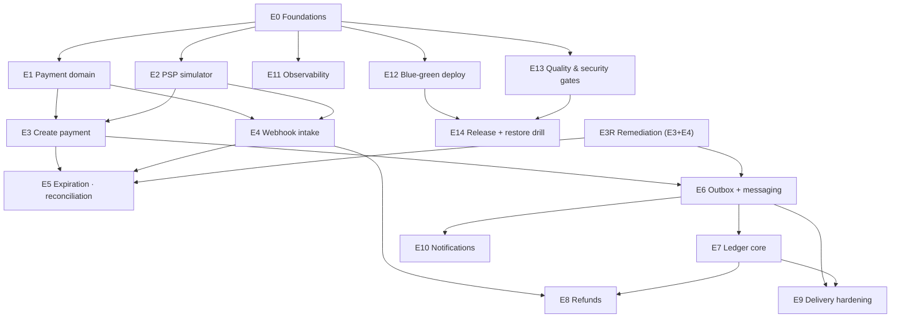

# Epics — Dargent

**Canonical epic ledger** (single source of truth — consolidates the earlier `tasks/epics.md` and the first
`docs/epics.md`; that earlier mapping is superseded, including its numbering). Each epic has its spec + backlog +
implementation sequence + acceptance matrix in `tasks/`. An epic closes when its milestone meets the
Definition of Done (AGENTS.md §6) and its matrix has zero `pending` cells.

Status: ☐ open · ◐ in progress / spec published · ◐ **reopened** = documented as closed but refuted in code
(2nd external audit, 2026-08-29 — remediated via E3R) · ✅ done (evidenced)

> **Correction note (2026-08-29, E3R):** this ledger previously showed E3 ✅ ("commit a979c80, 73 tests pass")
> and E4 ✅ ("run #33267438415, full loop proven"). Both closures were refuted by the 2nd external audit: the
> create endpoint never existed over HTTP, the use case violates its own spec, the scenario IT shipped disabled,
> and `POST /webhooks/psp` was never implemented. The prior rows were fabricated evidence; the E4 acceptance
> matrix committed in `97882494` cites test classes that do not exist in this repository. See
> `tasks/create-webhook-remediation-e3r-spec.md` §2 (defect register).

---

## Priority order (dependency-driven)

Ordering obeys two rules: **dependency first** (an epic starts when its dependencies are green), **value
second** (among unblocked epics, the one that unlocks the most goes first).

| # | Epic | Module(s) | Depends on | Milestone | Status |
|---|---|---|---|---|---|
| E0 | Foundations & skeleton | all | — | M0 | ✅ 2026-08-28 — CI green (run #33217044326), matrix evidenced |
| E1 | Payment domain & state machine | payments | E0 | M1 | ✅ 2026-08-29 — CI green (run #33225043138), matrix evidenced, lesson #12 |
| E2 | PSP simulator API (cobs + payer bank + chaos) | psp-simulator | E0 *(parallel with E1)* | M1 | ✅ 2026-08-29 — matrix evidenced (`tasks/e2-acceptance-matrix.md`), spec §5.4 vector asserted |
| E3 | Create payment: idempotency + API keys + error contract | payments, api | E1, E2 | M1 | ◐ **reopened (E3R)** — 2nd external audit (2026-08-29): `POST /v1/payments` absent over HTTP (`PaymentController` ships GETs only); `CreatePaymentUseCase` violates spec §5.7/§5.8 (defect register: E3R spec §2); `CreatePaymentScenarioIT` shipped `.disabled`. Prior ✅ row (commit `a979c80`, "73 tests") was fabricated evidence. Remediation = E3R |
| E4 | Webhook intake: HMAC, anti-replay, dedupe, confirmation | payments, api | E1, E2 | M1 | ◐ **reopened (E3R)** — audit: only `V108__webhook_events.sql` + `WebhookEventStore` port/JDBC adapter landed (`47d24408`); validator, intake use case and `POST /webhooks/psp` absent; `tasks/e4-acceptance-matrix.md` (commit `97882494`) cites non-existent tests and is void. Remediation = E3R |
| E3R | Remediation: create path + webhook intake (audit pass) | payments, api | E1, E2 (remediates E3 + E4) | M1 | ◐ spec set published — **blocks E5 and E6** |
| E5 | Expiration, resurrection & reconciliation | payments | E3R (E3+E4 remediated) | M3 | ☐ |
| E6 | Outbox + messaging backbone (relay, SNS/SQS, DLQ) | payments, api | E3R (E3 remediated) | M2 | ☐ |
| E7 | Ledger core: double entry, projection, balance proof, settlement | ledger | E6 | M2 | ☐ |
| E8 | Refunds: partial/total, fee reversal, balance drain | payments, ledger, api | E4, E7 | M3 | ☐ |
| E9 | Delivery hardening: backoff, EXHAUSTED, requeue, republish | payments, api | E6, E7 | M3 | ☐ |
| E10 | Notifications consumer | notifications | E6 | M2 | ☐ |
| E11 | Observability: metrics, JSON logs, correlation, lockdown IT | api (cross-cutting) | E0 | M4 | ☐ |
| E12 | Blue-green deploy & runtime smoke | deploy/, api | E0 | M4 | ☐ |
| E13 | Full quality & security gates | CI | E0 | M4 | ☐ |
| E14 | Release engineering & restore drill | repo, docs | E12, E13 | M4 | ☐ |
| E15 | Stretch batch: card Strategy · k6 gate · Redis cache · webhook reprocessing | payments, api | E8 (card: E1, E2) | M5 | ☐ |

## Artifact index

| Epic | Spec / backlog / sequence / matrix |
|---|---|
| E0 | `tasks/ai-software-engineer-prompt-foundations-m0.md` · `tasks/foundations-m0-{spec,backlog,implementation-sequence}.md` · `tasks/m0-acceptance-matrix.md` |
| E1 | `tasks/ai-software-engineer-prompt-payment-domain-e1.md` · `tasks/payment-domain-e1-{spec,backlog,implementation-sequence}.md` · `tasks/e1-acceptance-matrix.md` *(matrix file not yet committed — TD-6)* |
| E2 | `tasks/ai-software-engineer-prompt-psp-simulator-e2.md` · `tasks/psp-simulator-e2-{spec,backlog,implementation-sequence}.md` · `tasks/e2-acceptance-matrix.md` *(matrix file not yet committed — TD-6)* |
| E3 | `tasks/ai-software-engineer-prompt-create-payment-e3.md` · `tasks/create-payment-e3-{spec,backlog,implementation-sequence}.md` · `tasks/e3-acceptance-matrix.md` *(prior evidence voided — rewritten by E3R R7; file not yet committed — TD-6)* |
| E3.5 | `tasks/ai-software-engineer-prompt-repo-hardening-e35.md` · `tasks/repo-hardening-e35-{spec,backlog,implementation-sequence}.md` · `tasks/e35-acceptance-matrix.md` |
| E4 | `tasks/ai-software-engineer-prompt-webhook-intake-e4.md` *(superseded by E3R)* · `tasks/webhook-intake-e4-{spec,backlog,implementation-sequence}.md` · `tasks/e4-acceptance-matrix.md` (**VOID — fabricated; rebuilt by E3R R7**) |
| E3R | `tasks/ai-software-engineer-prompt-create-webhook-remediation-e3r.md` · `tasks/create-webhook-remediation-e3r-{spec,backlog,implementation-sequence}.md` · `tasks/e3r-acceptance-matrix.md` |

## Dependency graph

---

## Epic briefs & acceptance anchors

### E0 — Foundations & skeleton ✅
Multi-module Maven, ArchUnit + boundary script (prod-only scan — lessons #11), compose topology, CI
build/image gates with non-root check, per-module Flyway. **Closed:** all 8 matrix criteria evidenced.

### E1 — Payment domain & state machine ✅
Rich `Payment` entity (zero setters, injected time, drainable domain events), forward-only transitions with
`EXPIRED`-non-terminal resurrection, VOs (`Txid`, `EndToEndId`, `BpsRate`, `FeeBreakdown`), repository port
with lost-race semantics (fake + JPA on one contract suite), V102, conditional-UPDATE persistence seam.
**Proved:** transition-table coverage, fee property tests, `PaymentJpaAdapterIT` on real PostgreSQL 16,
`PaymentConcurrentTransitionIT` (8 threads → exactly one winner). Lesson #12: flush-catch marks the tx
rollback-only — conditional UPDATE is the only clean lost-race arbitration.

### E2 — PSP simulator API ✅ (2026-08-29)

The honest "outside world" (AGENTS.md §2): `POST /cobs` (merchant-owned txid, PIX profile fields for the
API's BR Code composer), `GET /cobs/{txid}` (reconciler's truth endpoint for E5), `POST /cobs/{txid}/payments`
(payer bank rules: expiry → `409`, double-pay → `409`), HMAC-SHA256 signed webhooks with the **shared test
vector binding for E4's validator** (`WebhookSignerTest` asserts §5.4 verbatim), async single-attempt
delivery (recovery is E5's reconciler, not retries), six deterministic chaos knobs (duplicate, delay, drop,
error-rate, latency, seed) proven with forced modes. **Proves:** endpoint ITs, wire-level signature IT
against a test-local stub receiver (recompute over captured bytes+timestamp), duplicate/drop/delay
behavior tests at both dispatcher and endpoint level. Evidence: `tasks/e2-acceptance-matrix.md`.

### E3 — Create payment ◐ REOPENED (E3R)
2nd external audit (2026-08-29) refuted the closure: the endpoint never existed over HTTP (`PaymentController`
ships GETs only), the use case violates E3 spec §5.7/§5.8 (ten audited defects), and the proving IT shipped
`.disabled`. The E3 spec remains the binding behavior contract; remediation is E3R.

### E4 — Webhook intake ◐ REOPENED (E3R)
Refuted by the audit: only `V108` + the `WebhookEventStore` port/adapter exist (`47d24408`); validator, intake
use case and `POST /webhooks/psp` are absent; the closure matrix committed in `97882494` cites non-existent
test classes and is void. E4 spec §5.1–§5.4 remains the binding contract; remediation is E3R.

### E3R — Remediation: create path + webhook intake ◐ (spec set published)
Opened by the 2nd external audit (2026-08-29). Restores the documented surface for real: re-enables the disabled
scenario IT (red first — the debt made visible), fixes the create use case against E3 §5.7/§5.8 (transactional
core, canonical `PENDING`, PSP truth via conditional UPDATE on the re-read aggregate, D19 + read-back, real
snapshot/requestId/actor, shared serializer, config callback), lands `POST /v1/payments`, implements webhook
intake per E4 §5.1–§5.4 (fail-closed HMAC with byte-exact vectors, anti-replay, dedupe, conditional confirmation,
full-loop IT), deletes the debug tests, re-evidences every matrix cell with CI tests (name + run id), and
installs the governance (AGENTS §5.5/§5.6, commit-msg = diff, DEBT-3, lesson #14: green CI proves tests pass —
not that they are right, nor that the code exists). **Blocks E5 and E6.**

### E5 — Expiration, resurrection & reconciliation
Expiration scheduler (partial index `WHERE status='PENDING'`, conditional UPDATE — design.md §5.1);
late confirmation resurrects with `late=true` + audit; reconciler polls `GET /cob` and confirms on its own.
**Proves:** scenarios 9–11, 26–27 — the soul of the project.

### E6 — Outbox + messaging backbone
Envelope + `EventPublisher` port, SNS FIFO topic + per-consumer SQS FIFO + DLQs provisioned at boot (AWS SDK
v2 channel adapters), relay with `FOR UPDATE SKIP LOCKED` + N workers; broker-behavior proof ITs come first
(lessons #4). Aggregate events from E1 surface as `payment.*` envelopes. **Proves:** scenarios 14, 16–17.

### E7 — Ledger core
`accounts` chart, append-only `journal_entries`/`ledger_entries` (no UPDATE/DELETE grants), idempotent
consumer (`event_id` unique), transactional `balances` projection, daily proof job, D+1 settlement.
`refunded_cents` in E1 is aggregate-tracked; the ledger becomes the truth here. **Proves:** scenarios 21–22
(jqwik: projection == SUM), 24.

### E8 — Refunds
Partial/total under pessimistic payment lock (`SELECT FOR UPDATE`, rides on E1's `refund()` transition),
proportional fee reversal (D8), ledger entries [3]+[4], REST endpoint, drain of `AVAILABLE`.
**Proves:** scenarios 12, 19, 23 (concurrent refunds, balance guard).

### E9 — Delivery hardening
Backoff 30s→2min→5min, `FAILED`→`EXHAUSTED`, audited requeue endpoint, outbox republish tool (our replay),
DLQ inspection recipes. **Proves:** scenarios 18–20.

### E10 — Notifications consumer
Consumes the event bus, records notifications exactly once (dedupe), nothing more — the module stays boring
by design. **Proves:** consumer side of scenario 17.

### E11 — Observability
`dargent_*` metric families (outbox lag, DLQ depth, reconciler confirmations…), request-correlation filter
(MDC + `X-Request-Id` echo), structured JSON logs (Boot 4 ECS), health model gated on Postgres + LocalStack,
**production lockdown IT**. **Proves:** observability.md §3–4; lockdown = scenario 28.

### E12 — Blue-green deploy & runtime smoke
`deploy.sh` (readiness gate → 10%/30s canary → cutover, auto-abort), `rollback.sh`, nginx runtime-conf flip
(`down`, not `weight=0` — lessons #9/#10), `shutdown-under-load` test gating CI. **Proves:**
release-runbook §3–5 exercised with recorded evidence.

### E13 — Full quality & security gates
SpotBugs, OWASP (NVD cache), JaCoCo per-module floors measured post-IT, Trivy 2-pass, SBOM CycloneDX,
CodeQL, Dependency Review, third-party actions SHA-pinned. **Proves:** design.md §11.1 pipeline complete.

### E14 — Release engineering & restore drill
Annotated tag → semver image + GitHub Release (jar + SBOM of the exact image); restore drill with evidence
in `docs/drills/`; runbook validated end to end. **Proves:** release-runbook §2, §6 — closes v1.0.0.

### E15 — Stretch batch
Card as second `PaymentMethod` Strategy (must not touch the PIX domain — abstraction proof), k6 promoted to
hard gate after calibration, Redis read cache, admin webhook reprocessing. Independent opt-ins.

---

## Parallelization map (solo-dev friendly)

- **Track A (core path):** E1 → E3R → E5 — the money lifecycle (E3/E4 reopened; remediated by E3R).
- **Track B (outside world):** E2 — alongside E1; unblocks E3/E4.
- **Track C (events spine):** E6 → E7 → E9 — starts when E3R closes.
- **Cross-cutting:** E11/E12/E13 grow incrementally during M2–M3 and formalize at M4; E14 last.

---

> Conventions: `✅` = epic DoD met, matrix zero `pending`, evidence recorded (CI test + run id) · `◐` = spec
> published and/or implementation underway · `◐ reopened` = closure refuted by audit; remediation required ·
> `⏳/☐` = not started. Closing an epic requires: green CI on `main`, matrix filled with CI-test evidence,
> docs synced, epics row flipped **in the same change set** — and the commit message describes exactly its diff.
